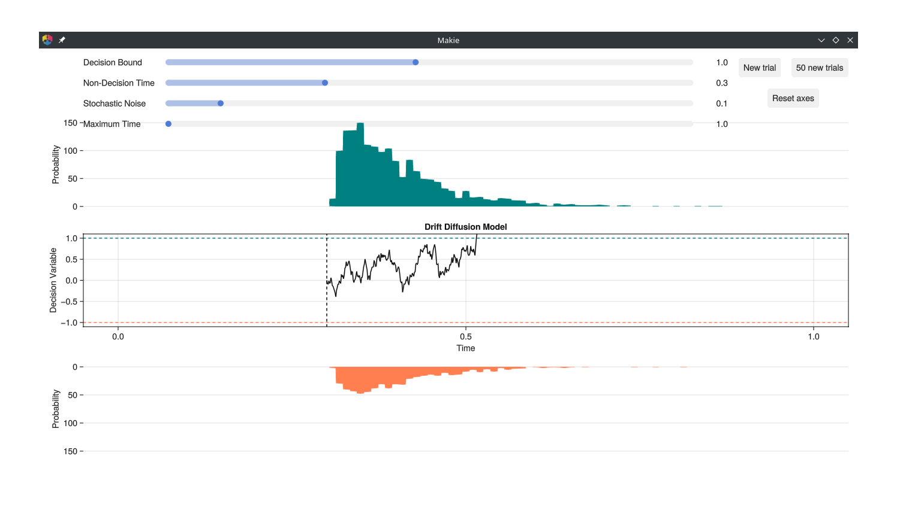

# DDM visualization

Visualizing the Drift Diffusion Model (DDM) with interactive Makie (GLMakie) plots.
Ratcliff, R., & McKoon, G. (2008). The diffusion decision model: Theory and data for two-choice decision tasks. Neural computation, 20(4), 873-922.

